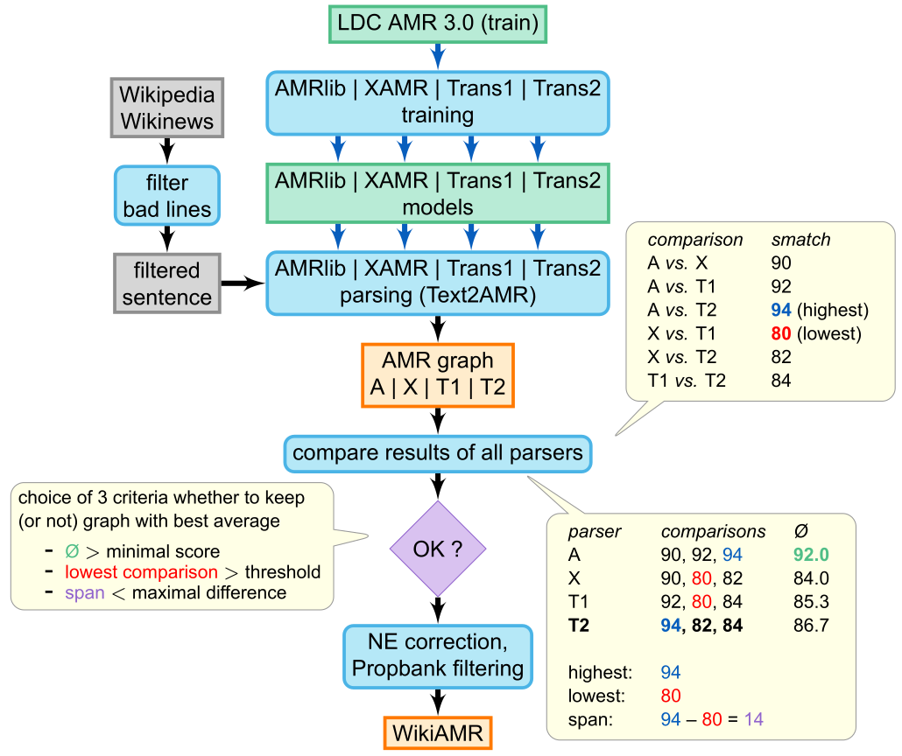

# Wiki-AMR: A high quality Abstract Meaning Representation dataset created automatically

We created an AMR dataset of 210,000 sentences (203,000 train, 7,000 dev) from sentences drawn mainly from the English Wikipedia.
The exact process is described in our paper (see below).

**Please note**: this data has not been validated manually. If you find any inconsistencies, please let us know or submit a pull request.


Due to a problem when extracting the sentences from Wikipedia and Wikinews, the sentence IDs (which point to the wikidata item of the page) are sometimes incorrect. I.e. a sentences with a Wikipedia ID can be in reality taken from Wikinews.

In a nutshell, we take sentences from Wikipedia pages and filter them in order to avoid processing sentence which are likely too difficult to parse.

We discard sentences:
 * which contain non-Latin characters, brackets or braces, and which lack a final punctuation mark. 
 * which are too short
 * which contain long sequences of digits (like ISBN numbers, etc). 
 * duplicates

We then parse the candidate sentences using four different parsers and compare the resulting graphs (using [Smatch](https://github.com/snowblink14/smatch)). If they are too different, we discard the sentence.
Else we check whether the most central graph (the graph which compares best with all the other three graphs) is formally correct:

* whether all verbal and adjectival concepts (i.e. those with  numerical suffixes like `-01`) are in fact defined in PropBank, and that all their outgoing relations ARGn in the graph are also defined for the given concept in [PropBank](https://propbank.github.io/)
* whether Named Entities and numbers in the graph also appear in the sentence

The parsers we used are
* [AMRlib](https://github.com/bjascob/amrlib) (trained on [AMR 3.0 data](https://catalog.ldc.upenn.edu/LDC2020T02))
* [X-AMR](https://github.com/jcyk/XAMR) (model provided on github site)
* [Transition AMR parser](https://github.com/IBM/transition-amr-parser) (to different models available on their github site)



## Results

We trained models with this data using a modified version of AMRlib (using Flan-T5 instead of T5) and obtained better results than with a model trained on AMR 3.0:

| train dataset	| AMR 3.0 test | [QALD-9](https://github.com/IBM/AMR-annotations) test | [DRS2AMR](https://gitlab.inria.fr/semagramme-public-projects/drs2amr) test |
| ------------- | ------------ | ----------- | ------------ |
| AMR~3.0 	| 82.5	       | 87.3	     | 83.2         |
| Wiki-AMR	| 82.8	(+0.3) | 89.2 (+1.9) | 84.2 (+1.0)  |
| both (mixed)	| 84.4	(+1.9) | 88.8 (+1.5) | 84.3 (+1.1)  |


# Licence

* The sentences are under the Wikipedia's licence ([Attribution-ShareAlike 4.0 International, CC BY-SA 4.0](https://creativecommons.org/licenses/by-sa/4.0))
* The AMR graphs are also under the CC BY-SA 4.0 licence 


# Reference

If you use this dataset, please cite our [article](https://lrec.elra.info/lrec2026-main-932):

```
@inproceedings{heinecke-etal-2026-creating,
  title = {Creating a High Quality Abstract Meaning Representation Dataset Automatically},
  author = {Heinecke, Johannes and Munshi, Asadullah and Herledan, Frédéric and Damnati, Geraldine},
  booktitle = {Proceedings of the Fifteenth Language Resources and Evaluation Conference (LREC 2026)},
  month = {May},
  year = {2026},
  pages = {11907--11915},
  address = {Palma, Mallorca, Spain},
  publisher = {European Language Resources Association (ELRA)},
  editor = {Piperidis, Stelios and Bel, Núria and van den Heuvel, Henk and Ide, Nancy and Krek, Simon and Toral, Antonio},
  doi = {10.63317/3qai4xpkg9v4},
  abstract = {As only a few gold training datasets are available today, Abstract Meaning Representation (AMR) parsers are mainly trained on AMR 3.0, the largest dataset (Knight et al., 2020) which contains 55k sentences for training. Even if great progress has been made, leading to parsers that can reach Smatch scores higher than 83% on the AMR 3.0 test dataset, this is not accurate enough to be used in real world application pipelines. More data could help improve performance, but manually annotating sentences is costly. So, we have investigated an approach to automatically create synthetic data using different existing tools and models trained on AMR 3.0. This leads to better parsing performance with Smatch scores increased by 1 to 2 points (depending on the 3 gold test datasets used) with models trained on the augmented data.}
  url = {https://lrec.elra.info/lrec2026-main-932},
}
```


